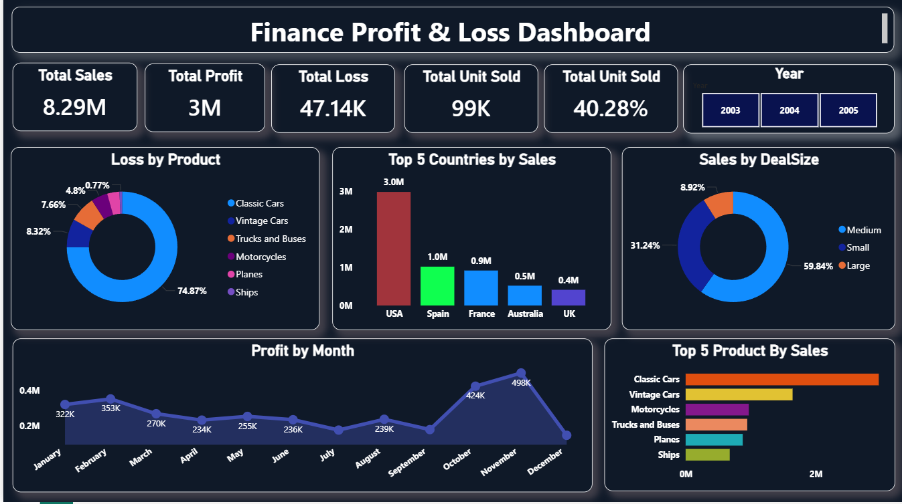

# 💰 Finance Profit & Loss Dashboard | Power BI

## 📌 Project Overview

The Finance Profit & Loss Dashboard is an interactive Power BI dashboard developed to analyze financial performance across sales, profit, loss, product categories, countries, and deal sizes. It enables business stakeholders to monitor key financial metrics, identify loss-making products, evaluate regional performance, and support strategic decision-making.

---

## 🎯 Business Problem

Financial data is often spread across multiple records, making it difficult to monitor overall business performance. Organizations require a centralized dashboard to track revenue, profitability, product performance, sales distribution, and financial losses. This dashboard provides clear insights into financial health and supports data-driven business decisions.

---

## 📂 Dataset

- **Source:** Kaggle – Financial Sales Dataset
- **Format:** CSV
- **Visualization Tool:** Microsoft Power BI Desktop

---

## 🧹 Data Preparation

The dataset contained missing values, blank records, and inconsistent data that required preprocessing before visualization.

The following data preparation steps were performed:

### Microsoft Excel
- Initial data inspection
- Verified column consistency
- Identified missing and invalid records

### Python
- Cleaned missing values
- Removed unnecessary records
- Performed additional preprocessing
- Exported cleaned dataset

### Power Query
- Removed duplicate records
- Corrected data types
- Replaced invalid values
- Renamed columns
- Applied final transformations before visualization

---

## 📊 Key Performance Indicators (KPIs)

- 💰 Total Sales
- 📈 Total Profit
- 📉 Total Loss
- 📦 Total Units Sold
- 📊 Profit Percentage

---

## 📈 Dashboard Features

- Interactive Year Filter
- Profit Trend by Month
- Top 5 Countries by Sales
- Top 5 Products by Sales
- Sales Distribution by Deal Size
- Product-wise Loss Analysis
- Interactive filtering across visuals

---

## 🧮 DAX Measures Used

The dashboard utilizes custom DAX measures including:

- `SUM()`
- `CALCULATE()`
- `DIVIDE()`
- `FILTER()`

Example:

```DAX
Profit Percentage =
DIVIDE([Total Profit],[Total Sales],0)
```

---

## 💡 Business Insights

- The USA generated the highest sales among all countries.
- Classic Cars contributed the highest sales while also representing the largest share of product losses.
- Medium-sized deals accounted for the largest percentage of total sales.
- Monthly profit trends reveal seasonal fluctuations, with peak profitability occurring toward the end of the year.
- The dashboard helps identify products and markets requiring focused financial analysis.

---

## 🛠 Tools & Technologies

- Microsoft Power BI
- Power Query
- DAX
- Python
- Microsoft Excel

---

## 📷 Dashboard Preview



---

## 📁 Repository Structure

```
Finance-Profit-Loss-Dashboard/
│
├── Finance_Profit_Loss_Dashboard.pbix
├── Dashboard.png
└── README.md
```

---

## 🚀 How to Use

1. Download the `.pbix` file.
2. Open it using **Microsoft Power BI Desktop**.
3. Use the **Year** filter to analyze financial performance over time.
4. Explore profit trends, sales distribution, country-wise sales, product performance, and loss analysis.

---

## 👨‍💻 Author

**Nikhil**

**Aspiring Data Analyst**

### Skills Demonstrated

- Power BI
- Power Query
- DAX
- Python
- Microsoft Excel
- Data Cleaning
- Financial Analytics
- Business Intelligence
- Data Visualization

---

⭐ If you found this project useful, consider giving the repository a star.