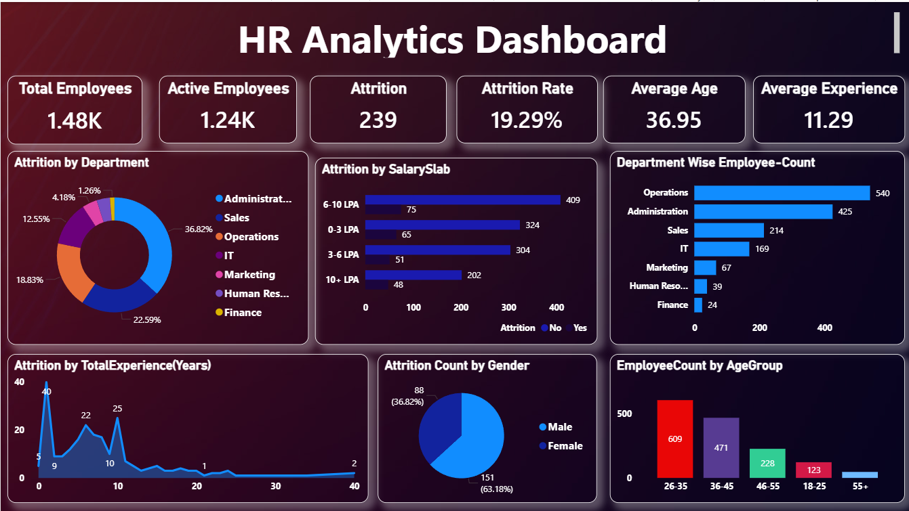

# 👨‍💼 HR Analytics Dashboard | Power BI

## 📌 Project Overview

The HR Analytics Dashboard is an interactive Power BI dashboard designed to analyze workforce data, employee attrition, department-wise employee distribution, salary trends, and workforce demographics. It provides HR professionals and business leaders with actionable insights to improve employee retention and support strategic workforce planning.

---

## 🎯 Business Problem

Employee attrition is one of the biggest challenges for organizations. HR teams require a centralized dashboard to monitor workforce health, identify departments with high attrition, analyze employee demographics, and understand salary distribution. This dashboard enables HR managers to make informed decisions for improving employee retention and optimizing workforce management.

---

## 📂 Dataset

- **Source:** IBM HR Analytics Employee Attrition Dataset (Kaggle)
- **Format:** CSV
- **Visualization Tool:** Microsoft Power BI Desktop

---

## 🧹 Data Preparation

The dataset was cleaned and transformed using **Power Query** before building the dashboard.

The following preprocessing steps were performed:

- Removed duplicate records
- Corrected data types
- Replaced missing values
- Renamed columns for better readability
- Validated employee records
- Created calculated measures using DAX

---

## 📊 Key Performance Indicators (KPIs)

- 👥 Total Employees
- ✅ Active Employees
- 📉 Employee Attrition
- 📊 Attrition Rate (%)
- 🎂 Average Age
- 💼 Average Experience

---

## 📈 Dashboard Features

- Department-wise Attrition Analysis
- Attrition by Salary Slab
- Department-wise Employee Count
- Attrition by Total Experience
- Gender Distribution
- Employee Distribution by Age Group
- Interactive visual analysis

---

## 🧮 DAX Measures Used

The dashboard utilizes custom DAX measures including:

- `SUM()`
- `CALCULATE()`
- `DIVIDE()`
- `FILTER()`

Example:

```DAX
Attrition Rate =
DIVIDE([Attrition],[Total Employees],0)
```

---

## 💡 Business Insights

- Operations and Administration departments have the highest employee count.
- Employees with lower salary slabs show comparatively higher attrition.
- Most employees belong to the 26–35 age group.
- The workforce consists of a higher percentage of male employees.
- Attrition varies across departments, helping HR identify areas requiring retention strategies.
- Employee experience distribution provides insights into workforce maturity.

---

## 🛠 Tools & Technologies

- Microsoft Power BI
- Power Query
- DAX
- Microsoft Excel

---

## 📷 Dashboard Preview



---

## 📁 Repository Structure

```
HR-Analytics-Dashboard/
│
├── HR_Analytics_Dashboard.pbix
├── Dashboard.png
└── README.md
```

---

## 🚀 How to Use

1. Download the `.pbix` file.
2. Open it using **Microsoft Power BI Desktop**.
3. Explore workforce KPIs and employee demographics.
4. Analyze attrition trends across departments, salary slabs, age groups, and employee experience.

---

## 👨‍💻 Author

**Nikhil**

**Aspiring Data Analyst**

### Skills Demonstrated

- Power BI
- Power Query
- DAX
- HR Analytics
- Data Cleaning
- Data Visualization
- Business Intelligence
- Microsoft Excel

---

⭐ If you found this project useful, consider giving the repository a star.