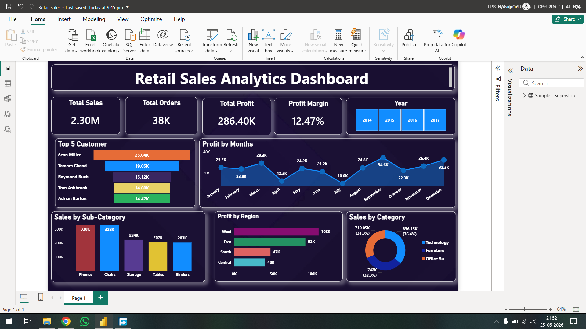

# 📊 Retail Sales Analytics Dashboard | Power BI

## 📌 Project Overview

The Retail Sales Analytics Dashboard is an interactive Power BI dashboard developed to analyze retail business performance across sales, profit, customers, regions, and product categories. It provides decision-makers with a clear overview of key business metrics and helps identify trends, top-performing customers, profitable regions, and high-selling product categories.

---

## 🎯 Business Problem

Retail businesses generate large volumes of transactional data, making it difficult to monitor overall performance and identify growth opportunities. This dashboard provides a centralized view of important business KPIs, enabling stakeholders to track sales performance, evaluate profitability, understand customer behavior, and make data-driven business decisions.

---

## 📂 Dataset

- **Source:** Kaggle – Sample Superstore Dataset
- **Format:** CSV
- **Visualization Tool:** Microsoft Power BI Desktop

---

## 🧹 Data Preparation

The dataset was cleaned and transformed using **Power Query** before building the dashboard.

The following preprocessing steps were performed:

- Removed duplicate records
- Corrected data types
- Renamed columns for better readability
- Handled missing values
- Validated data consistency
- Created calculated measures using DAX

---

## 📊 Key Performance Indicators (KPIs)

- 💰 Total Sales
- 📦 Total Orders
- 📈 Total Profit
- 📊 Profit Margin (%)

---

## 📈 Dashboard Features

- Interactive **Year** slicer
- Monthly Profit Trend Analysis
- Top 5 Customers by Sales
- Sales by Product Sub-Category
- Profit by Region
- Sales Distribution by Category
- Interactive cross-filtering across visuals

---

## 🧮 DAX Measures Used

The dashboard utilizes custom DAX measures, including:

- `SUM()`
- `CALCULATE()`
- `DIVIDE()`

Example:

```DAX
Profit Margin =
DIVIDE([Total Profit], [Total Sales], 0)
```

---

## 💡 Business Insights

- Technology contributes the highest share of total sales.
- The West region generates the highest overall profit.
- September recorded the highest monthly profit.
- The dashboard identifies the Top 5 customers based on total sales, helping businesses recognize high-value customers.
- Sales are distributed across multiple product sub-categories, enabling category-level performance analysis.

---

## 🛠 Tools & Technologies

- Microsoft Power BI
- Power Query
- DAX
- Microsoft Excel

---

## 📷 Dashboard Preview



---

## 📁 Repository Structure

```
Retail-Sales-Analytics-Dashboard/
│
├── Retail_Sales_Analytics_Dashboard.pbix
├── Dashboard.png
└── README.md
```

---

## 🚀 How to Use

1. Download the `.pbix` file.
2. Open it using **Microsoft Power BI Desktop**.
3. Interact with the **Year** slicer to filter the dashboard.
4. Explore customer performance, monthly profit trends, regional profitability, and product category analysis.

---

## 👨‍💻 Author

**Nikhil**

**Aspiring Data Analyst**

### Skills Demonstrated

- Power BI
- Power Query
- DAX
- Data Cleaning
- Data Visualization
- Business Intelligence
- Microsoft Excel

---

⭐ If you found this project useful, consider giving the repository a star.
